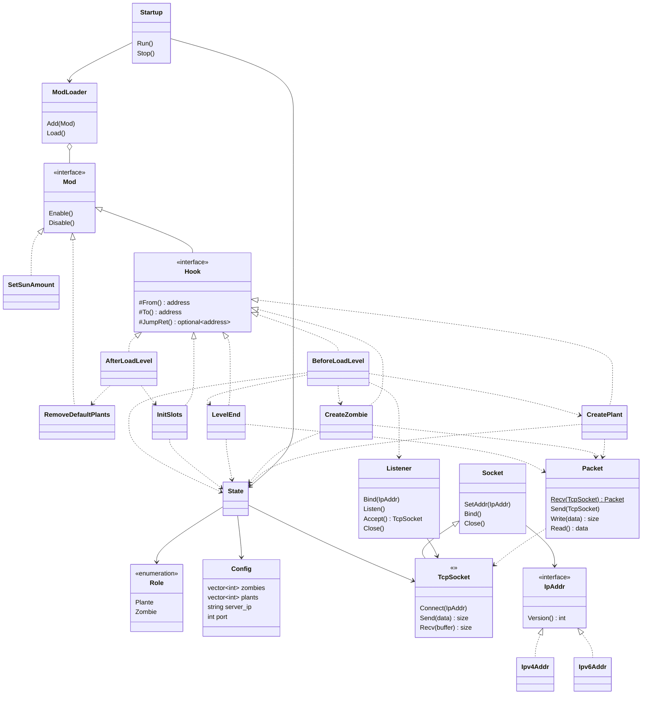

# Plants vs. Zombies Online Battle


[](https://cmake.org)
[](https://visualstudio.microsoft.com/)
[](https://www.microsoft.com/en-ie/windows)


## Introduction


This project adds the multiplayer battle to ***Plants vs. Zombies*** via reverse engineering, inline hook and dynamic-link library injection. Two online players can defend and attack as *Plant* and *Zombie* respectively.

## Getting Started

### Prerequisites

- Install [*Visual Studio 2022*](https://visualstudio.microsoft.com).
- Install [*CMake*](https://cmake.org).
- Set the `PATH` environment variables.

### Building

Set the location to the project folder and run:

```bash
mkdir -p build
cd build
cmake .. -G "Visual Studio 17 2022" -A Win32
cmake --build .
```

Two dynamic-link libraries `plant.dll` and `zombie.dll` will be generated in `build/bin` folder. Copy them to the game root folder.

#### IPv6

The default *IP* version is *IPv4*. Enable the following statement in `libs/game/CMakeLists.txt` if you want to build *IPv6* libraries.

```cmake
target_compile_definitions(game PRIVATE INET6=1)
```

## Usage

> The project only works with *Plants vs. Zombies **1.0.0.1051 CHINESE*** version, provided in `game` folder.
>
> The *MD5* of `PlantsVsZombies.exe` is `37B729B4056131722A556E646AC915E9`.

In order to activate online functions, `plant.dll` and `zombie.dll` must be injected into the game when it starts. You can directly use this simple injection tool: [*Dll-Injector*](https://github.com/Zhuagenborn/Windows-DLL-Injector).


### Playing as Plant

If a player plays as the plant, the game will launch as a server.

```bash
Dll-Injector -f PlantsVsZombies.exe plant.dll
```

Or use `Start-OnlineGame.ps1` directly. It needs to be copied to the game root folder.

```powershell
Start-OnlineGame.ps1 -Role Plant
```

Start *I, Zombie Endless* level, the game will pause and wait for a client to connect.

### Playing as Zombie

If a player plays as the zombie, the game will launch as a client.

```bash
Dll-Injector -f PlantsVsZombies.exe zombie.dll
```

Or use `Start-OnlineGame.ps1`.

```powershell
Start-OnlineGame.ps1 -Role Zombie
```

Start *I, Zombie Endless* level, the game will try to connect to the server.

### I, Zombie Endless

If the modification has been loaded successfully, ***I, Zombie Endless*** level will be converted into an online level. If your current progress does not have this level, you can copy `game/userdata` to `C:\ProgramData\PopCap Games\PlantsVsZombies\userdata`. Remember to back up your own save-files before copying.

In the Chinese version of the game, you can start this level as follows:

1. Select "*解谜模式*", which means "*Puzzle*" in English.

    

2. Select "*我是僵尸无尽版*", the final level. It is "*I, Zombie Endless*" in English.

    

3. The game will display a dialog box shown as below. Select "*继续*", the left button, meaning "*Continue*" in English.

    

    Before starting an online battle, the progress of this level must be empty. Otherwise the battlefields of two online players will be different. If that happens, you need to restart the game without the modification, enter this level again but select "*新游戏*", the right button, to reset the progress. It means "*New Game*".

### Configurations

Copy `online_config.ini` to the game root folder. You can set the server's IP address and port number in it.

```ini
[Network]
ServerIP=127.0.0.1
Port=10000
```

## Documents

The code comment style follows the [*Doxygen*](http://www.doxygen.nl) specification.

`docs/Key Data and Functions.md` describes key data and functions obtained by reverse engineering.

### Class Diagram



## Issues & Bugs

- The game sometimes crashes when creating zombies.
- If the progress of *I, Zombie Endless* level is not empty, two players will have different battlefields.
- In order to simplify the code, the running menu and automatic pause are disabled.

## License

Distributed under the *MIT License*. See `LICENSE` for more information.